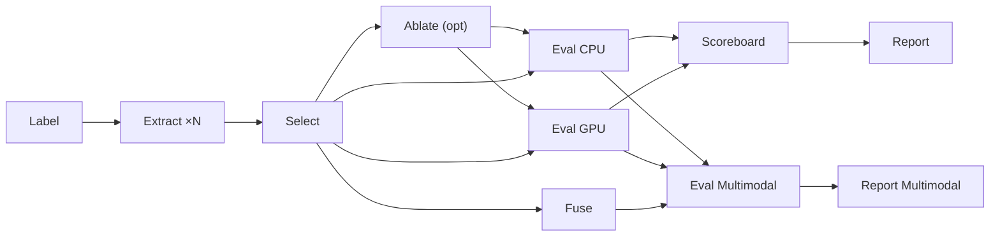

<div align="center">
  
  
  
  
  <a href="https://deepwiki.com/msk-access/kreview"></a>
  
  <h1>kreview</h1>
  <p><b>Advanced cfDNA Fragmentomics Core Evaluation Engine</b></p>
</div>

---

## 🧬 Overview

`kreview` is a production-grade, notebook-first (`nbdev`) evaluation engine designed for high-throughput cancer liquid biopsy fragmentomics feature analysis. Developed at Memorial Sloan Kettering (MSKCC), it processes cohorts containing tens of thousands of samples using an embedded DuckDB query engine with chunked I/O and automatic retry logic.

📖 **[Full Documentation](https://msk-access.github.io/kreview/)**

## 🚀 Features

- **5-Tier ctDNA Taxonomy**: MSK-IMPACT paired-inference to label `True ctDNA+`, `Possible ctDNA+`, `Possible ctDNA−`, `Healthy Normal`, and `Insufficient Data`. Optional CH hotspot demotion via `--ch-hotspot-maf`.
- **DuckDB Dynamic Data Lake**: In-memory `read_parquet` bindings with chunked I/O and exponential backoff retry. Builds a merged SQL-queryable `kreview_lake.duckdb` on demand.
- **Multi-Model Evaluation**: Logistic Regression, Random Forest, and XGBoost (CPU) plus TabPFN and TabICL (GPU) with Stratified K-Fold CV, SHAP explainability, and subgroup analysis.
- **Nested CV Feature Ablation**: Automated feature group subset selection via inner-loop cross-validation, eliminating non-informative feature groups before final evaluation. Uses `sensitivity_at_100spec_healthy` as the optimization metric.
- **Feature Selection**: [mRMR](https://github.com/smazzanti/mrmr) (Minimum Redundancy Maximum Relevance) as default strategy — iteratively selects features maximizing target relevance while minimizing inter-feature redundancy. Legacy `hybrid_union` (AUC ∪ MI) also available.
- **Multimodal Stacking**: Cross-evaluator fusion via super-matrix with Mutual Information or [Boruta-SHAP](https://github.com/Ekeany/Boruta-Shap) selection, followed by stacking ensemble + ablation analysis.
- **Interactive Dashboards**: Plotly-native HTML reports with ROC curves, violin plots, SHAP beeswarm/waterfall, mRMR scatter plots, per-cancer-type sensitivity tables, and Decision Curve Analysis.
- **Nextflow HPC Integration**: Decomposed multistage DAG for SLURM-based HPC execution with per-evaluator parallelism, GPU scheduling, and automatic retry logic.
- **26 Built-In Evaluators**: Modular extractors covering fragment sizes (FSC, FSD, FSR), nucleosome protection (WPS, TFBS), cleavage motifs (EndMotif, BreakPointMotif), chromatin accessibility (ATAC), motif divergence (MDS), and orientation (OCF).

## 🏗️ Pipeline Architecture



The pipeline supports two modes:

| Mode | Command | Use Case |
|------|---------|----------|
| **Monolithic** | `kreview run` | Single-machine, sequential execution |
| **Multistage** | `nextflow run ... -profile iris` | HPC parallelism, per-evaluator scatter |

## ⚙️ Quick Start

### Installation

> [!IMPORTANT]
> **Quarto is strictly required** for programmatic dashboard generation. Because `quarto-cli` wrapper packages are unreliable across Python environments, `kreview` assumes the Quarto executable is installed dynamically on your OS or container.

#### Option 1: Docker (Recommended "Batteries-Included" Method)
The easiest way to run `kreview` without managing external dependencies is to use our pre-built Docker containers (hosted on GHCR). They ship with `Python 3.12`, all ML libraries, and `quarto`:
```bash
# CPU image (~1.5 GB) — for all standard pipeline processes
docker pull ghcr.io/msk-access/kreview:latest

# GPU image (~8-10 GB) — adds PyTorch, TabPFN, TabICL (requires NVIDIA drivers)
docker pull ghcr.io/msk-access/kreview:latest-gpu

# Run
docker run -v /your/data:/data ghcr.io/msk-access/kreview:latest \
  kreview run --cancer-samplesheet /data/cancer.csv ...
```

#### Option 2: Local Install (Pip)
If you install via pip, you **must separately install Quarto** via your OS manager:
1. **Install Quarto:** Follow the [official Quarto Installation Guide](https://quarto.org/docs/get-started/) (e.g. `brew install quarto` on macOS).
2. **Install kreview:**
```bash
git clone https://github.com/msk-access/kreview.git
cd kreview
pip install -e .          # CPU models only
pip install -e ".[gpu]"   # + TabPFN, TabICL (requires CUDA)
```

### Running the Pipeline

#### Local (Single Machine)

```bash
kreview run \
  --cancer-samplesheet "/path/to/cancer/samplesheet.csv" \
  --healthy-xs1-samplesheet "/path/to/healthy/xs1/samplesheet.csv" \
  --healthy-xs2-samplesheet "/path/to/healthy/xs2/samplesheet.csv" \
  --cbioportal-dir "/path/to/cBioPortal_MAF_CNA_SV/" \
  --krewlyzer-dir "/path/to/unified_krewlyzer_results" \
  --output output/ \
  --strategy mrmr \
  --top-percentile 10 \
  --compute-univariate-auc \
  --ch-hotspot-maf "/path/to/ch_hotspots.maf" \
  --export-duckdb
```

#### HPC (Nextflow + SLURM)

```bash
nextflow run /path/to/kreview/nextflow/main.nf \
  --cancer_samplesheet /path/to/cancer.csv \
  --healthy_xs1_samplesheet /path/to/healthy_xs1.csv \
  --healthy_xs2_samplesheet /path/to/healthy_xs2.csv \
  --cbioportal_dir /path/to/cbioportal/ \
  --krewlyzer_dir /path/to/manifest.txt \
  --outdir /path/to/output/ \
  --pipeline_mode multistage \
  --run_gpu_eval true \
  --gpu_models "tabpfn,tabicl" \
  --run_ablation true \
  --run_multimodal_eval true \
  -profile iris
```

### Dashboard Access

Once finished, open the generated HTML reports:
```bash
open output/reports/ATAC_dashboard.html
```

## 🧪 Feature Selection

| Strategy | Scope | Method | Default |
|----------|-------|--------|---------|
| `mrmr` | Single-evaluator | F-statistic relevance + Pearson redundancy penalty | ✅ |
| `hybrid_union` | Single-evaluator | Top-X% AUC ∪ Top-X% MI | Legacy |
| Nested CV ablation | Single-evaluator | Inner CV on feature group subsets → best subset per model | Optional (`--run-ablation`) |
| `mi` | Multimodal | Mutual Information top-K ranking | ✅ |
| `boruta_shap` | Multimodal | SHAP importance vs shadow variables (50 trials) | Optional |

See [Statistical Evaluation](https://msk-access.github.io/kreview/machine-learning/statistical-tests/) for full documentation.

## 📓 nbdev Architecture

This project operates as an `nbdev` repo. Do **not** edit `.py` scripts manually in `kreview/`. Build natively inside Jupyter notebooks within `nbs/` and trigger:
```bash
nbdev_export
```

## 📚 Resources

- **[Documentation](https://msk-access.github.io/kreview/)** — Full user and developer guide
- **[Contributing](CONTRIBUTING.md)** — How to contribute
- **[Changelog](https://msk-access.github.io/kreview/changelog/)** — Version history
