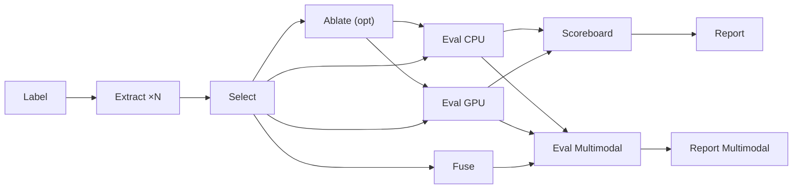

<div align="center">
  
  
  
  <a href="https://deepwiki.com/msk-access/kreview"></a>
  
  <h1>kreview</h1>
  <p><b>Advanced cfDNA Fragmentomics Core Evaluation Engine</b></p>
</div>

---

## 🧬 Overview

`kreview` is a production-grade, notebook-first (`nbdev`) evaluation engine designed for high-throughput cancer liquid biopsy fragmentomics feature analysis. Developed at Memorial Sloan Kettering (MSKCC), it processes cohorts containing tens of thousands of samples using an embedded DuckDB query engine with chunked I/O and automatic retry logic.

📖 **[Full Documentation](https://msk-access.github.io/kreview/)**

## 🚀 Features

- **6-Tier ctDNA Taxonomy**: MSK-IMPACT paired-inference to label `True ctDNA+`, `Possible ctDNA+`, `Possible ctDNA−`, `Healthy Normal`, `Insufficient Data`, and `Undetermined`. Four are modelled (two positive, two negative); `Undetermined` and `Insufficient Data` are excluded. Optional CH hotspot demotion via `--ch-hotspot-maf` sends CH-only samples to `Undetermined`.
- **DuckDB Query Engine**: In-memory `read_parquet` bindings with chunked I/O and exponential backoff retry for cohort-scale feature loading.
- **Multi-Model Evaluation**: Logistic Regression, Random Forest, and XGBoost (CPU) plus TabPFN and TabICL (GPU) with Stratified K-Fold CV, SHAP explainability, and subgroup analysis.
- **Nested CV Feature Ablation**: Automated feature group subset selection via inner-loop cross-validation, eliminating non-informative feature groups before final evaluation. Uses `sensitivity_at_100spec_healthy` as the optimization metric.
- **Feature Selection**: [mRMR](https://github.com/smazzanti/mrmr) (Minimum Redundancy Maximum Relevance) as default strategy — iteratively selects features maximizing target relevance while minimizing inter-feature redundancy. Legacy `hybrid_union` (AUC ∪ MI) also available.
- **Multimodal Stacking**: Cross-evaluator fusion via super-matrix with [GrootCV](https://github.com/ThomasBury/arfs) selection by default since #96 — cross-validated LightGBM/SHAP importances tested against shadow features — followed by stacking ensemble + leave-one-evaluator-out ablation. Mutual Information remains available; Boruta-SHAP is a legacy extra that cannot be installed alongside arfs.
- **Single-Page Report**: one self-contained, plotly-interactive HTML built from the run's aggregates, across five tabs — cohort composition with the pre-registered primary endpoint and its patient-clustered interval, a verification-bias ladder showing how much the headline moves with the choice of negatives, a sortable evaluator scoreboard with deep-dive modals (ROC/PR, calibration, decision curves, subgroup AUCs with tier composition, feature-group ablation stability), multimodal stacking, run diagnostics with the pipeline DAG and this run's task counts, and a methods tab. No Quarto, no render-time SHAP, PHI-free by construction.
- **Nextflow HPC Integration**: Decomposed multistage DAG for SLURM-based HPC execution with per-evaluator parallelism, GPU scheduling, and automatic retry logic.
- **26 Built-In Evaluators**: Modular extractors covering fragment sizes (FSC, FSD, FSR), nucleosome protection (WPS, TFBS), cleavage motifs (EndMotif, BreakPointMotif), chromatin accessibility (ATAC), motif divergence (MDS), and orientation (OCF).

## 🏗️ Pipeline Architecture


```mermaid
graph LR
    A[Label] --> B["Extract ×N"]
    B --> C[Select]
    C --> D["Ablate (opt)"]
    D --> E["Eval CPU"]
    D --> F["Eval GPU"]
    C --> E
    C --> F
    C --> G[Fuse]
    E --> H[Scoreboard]
    F --> H
    E --> I["Eval Multimodal"]
    F --> I
    G --> I
    H --> J[Report]
    I --> K["Report Multimodal"]
```

The pipeline runs as a **Nextflow multistage DAG** — one implementation, scattered
per-evaluator. Use `-profile docker` locally and `-profile iris`/`slurm` on HPC.
Supported Nextflow: **v25–v26**.

## ⚙️ Quick Start

### Installation


#### Option 1: Docker (Recommended "Batteries-Included" Method)
The easiest way to run `kreview` without managing external dependencies is to use our pre-built Docker containers (hosted on GHCR). They ship with `Python 3.12` and all ML libraries:
```bash
# CPU image (~1.5 GB) — for all standard pipeline processes
docker pull ghcr.io/msk-access/kreview:latest

# GPU image (~8-10 GB) — adds PyTorch, TabPFN, TabICL (requires NVIDIA drivers)
docker pull ghcr.io/msk-access/kreview:latest-gpu

# The images are driven by Nextflow, one container per pipeline stage:
nextflow run /path/to/kreview/nextflow/main.nf -profile docker --outdir results/ ...

# Individual stages can also be invoked directly for debugging:
docker run -v /your/data:/data ghcr.io/msk-access/kreview:latest \
  label --cancer-samplesheet /data/cancer.csv ...
```

#### Option 2: Local Install (Pip)
```bash
git clone https://github.com/msk-access/kreview.git
cd kreview
pip install -e .            # CPU models only
pip install -e ".[all]"     # + arfs feature selection, docs, dev, test (CPU)
pip install -e ".[gpu]"     # + TabPFN, TabICL (requires CUDA)
```

### Running the Pipeline

#### Local (single machine, Docker)

```bash
nextflow run /path/to/kreview/nextflow/main.nf \
  --cancer_samplesheet "/path/to/cancer/samplesheet.csv" \
  --healthy_xs1_samplesheet "/path/to/healthy/xs1/samplesheet.csv" \
  --healthy_xs2_samplesheet "/path/to/healthy/xs2/samplesheet.csv" \
  --cbioportal_dir "/path/to/cBioPortal_MAF_CNA_SV/" \
  --krewlyzer_dir "/path/to/unified_krewlyzer_results" \
  --outdir output/ \
  --strategy mrmr \
  --top_percentile 10 \
  --ch_hotspot_maf "/path/to/ch_hotspots.maf" \
  -profile docker
```

Individual stages are also available as subcommands (`kreview label`, `extract`, `select`,
`eval cpu|gpu`, `fuse`, `report`) for debugging a single step outside the DAG.

#### HPC (Nextflow + SLURM)

```bash
nextflow run /path/to/kreview/nextflow/main.nf \
  --cancer_samplesheet /path/to/cancer.csv \
  --healthy_xs1_samplesheet /path/to/healthy_xs1.csv \
  --healthy_xs2_samplesheet /path/to/healthy_xs2.csv \
  --cbioportal_dir /path/to/cbioportal/ \
  --krewlyzer_dir /path/to/manifest.txt \
  --outdir /path/to/output/ \
  --run_gpu_eval true \
  --gpu_models "tabpfn,tabicl" \
  --run_ablation true \
  --run_multimodal_eval true \
  -profile iris
```

### Dashboard Access

Once finished, open the single-page report:
```bash
open output/reports/kreview_report.html
```

## 🧪 Feature Selection

| Strategy | Scope | Method | Default |
|----------|-------|--------|---------|
| `mrmr` | Single-evaluator | F-statistic relevance + Pearson redundancy penalty | ✅ |
| `hybrid_union` | Single-evaluator | Top-X% AUC ∪ Top-X% MI | Legacy |
| Nested CV ablation | Single-evaluator | Inner CV on feature group subsets → best subset per model | Optional (`--run-ablation`) |
| `mi` | Multimodal | Mutual Information top-K ranking | Fast exploration |
| `grootcv` | Multimodal | Cross-validated LightGBM/SHAP vs shadow variables (arfs) — most stable selection measured (#96) | ✅ Default |
| `leshy` | Multimodal | Boruta evolution with LightGBM/SHAP (arfs) | Optional |
| `boruta_shap` | Multimodal | SHAP importance vs shadow variables (50 XGBoost trials) | Deprecated (#96, `[legacy-boruta]` extra) |

See [Statistical Evaluation](https://msk-access.github.io/kreview/machine-learning/statistical-tests/) for full documentation.

## 📓 nbdev Architecture

This project operates as an `nbdev` repo. Do **not** edit `.py` scripts manually in `kreview/`. Build natively inside Jupyter notebooks within `nbs/` and trigger:
```bash
nbdev-export && black kreview/   # note: `python3 -m nbdev.export` is a silent no-op
```

## 📚 Resources

- **[Documentation](https://msk-access.github.io/kreview/)** — Full user and developer guide
- **[Contributing](CONTRIBUTING.md)** — How to contribute
- **[Changelog](https://msk-access.github.io/kreview/changelog/)** — Version history
