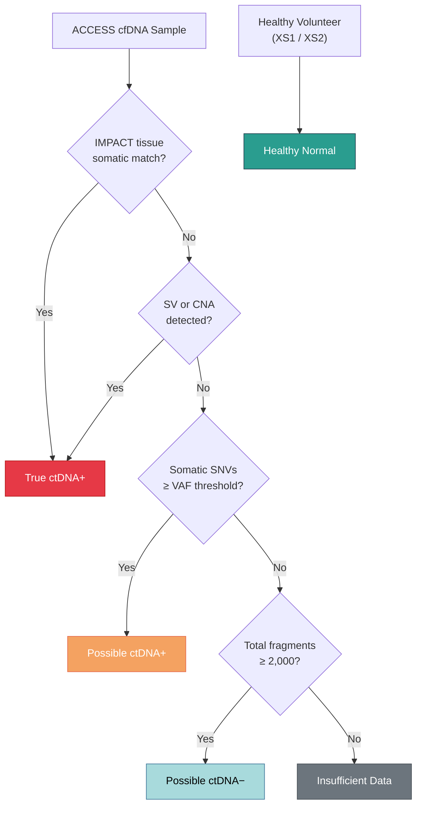

# ctDNA Labeling Engine

`kreview` evaluates computational fragmentomic features by measuring how accurately they distinguish tumor-derived circulating tumor DNA (ctDNA) from normal apoptotic background DNA.

To do this, it first establishes a rigid "Ground Truth" label matrix utilizing the `CtDNALabeler` engine (`kreview.labels`), relying strictly on MSK-IMPACT orthogonal tissue assays.

---

## 🔬 The Biological Assumption

Unlike standard genomics which calls somatic variants directly from the blood, **Fragmentomics** relies on subtle physical signatures—like fragment sizes, nucleosome imprints, and cleavage end-motifs—measured broadly across the entire epigenome.

Because we are evaluating *new* experimental fragmentomic models, we need incontrovertible proof that the patient sample actually *has* ctDNA present. For this, we look at **Variant Allele Frequency (VAF)**:

```math
VAF = \frac{\text{Alternate Allele Depth (t\_alt\_count)}}{\text{Total Depth (t\_ref\_count + t\_alt\_count)}}
```

If a sample contains somatic Single Nucleotide Variants (SNVs) with a high detectable VAF, or massive Copy Number Alterations (CNAs) / Structural Variants (SVs), then the physical tumor footprint in the blood is high.

---

## 🏷️ The 5-Tier Labeling Hierarchy



`kreview` assigns every sample one of five labels:

### 1. True ctDNA+

The gold standard. This label is granted **only** if one of three conditions is met:

- An SNV mutation detected in the blood cfDNA perfectly matches a somatic mutation detected in the patient's matched solid-tissue MSK-IMPACT biopsy.
- A macroscopic structural variant (SV) is positively called.
- Wide-scale somatic Copy Number Alterations (CNAs) are detected.

### 2. Possible ctDNA+

The silver standard. The sample lacks a matched MSK-IMPACT tissue biopsy (or the biopsy was negative), but the ACCESS assay still detected somatic SNVs passing the configured stringency threshold:

```math
VAF \ge 0.01 \quad \text{and} \quad n_{variants} \ge 1
```

!!! info "Configurable Thresholds"
    These defaults are configurable via the CLI flags `--min-vaf` and `--min-variants`, or directly through the `LabelConfig` dataclass.

### 3. Possible ctDNA−

Symptomatic cancer patients whose blood cfDNA draws generated zero signal: **No SNVs, No SVs, No CNAs**. While they have cancer, their systemic shedding rate is too low for traditional orthogonal validation.

### 4. Healthy Normal

True negative controls. Drawn entirely from the MSK `XS1` and `XS2` healthy volunteer sequencing runs. Their data establishes the baseline apoptotic fragmentation profile.

### 5. Insufficient Data

!!! warning "QC Gate"
    If a cancer sample shows absolutely **no** positive signal (no SNVs, no SVs, no CNAs), **AND** their sequencing coverage yielded fewer than `min_fragments` total fragments (default: 2,000), the pipeline assigns them to this bucket instead of `Possible ctDNA−`.

    These samples are entirely excluded from the ML algorithms so low-depth noise doesn't corrupt the models.

---

## Label Distribution

A typical production cohort produces a distribution like:

| Label | Typical % | ML Role |
|-------|-----------|---------|
| True ctDNA+ | ~25% | Positive class (highest confidence) |
| Possible ctDNA+ | ~35% | Positive class (medium confidence) |
| Possible ctDNA− | ~15% | Excluded or negative class |
| Healthy Normal | ~20% | Negative class (control baseline) |
| Insufficient Data | ~5% | Excluded from ML |

!!! tip "Binary Classification"
    For the ML pipeline, `True ctDNA+` and `Possible ctDNA+` are merged into a single binary positive class. `Healthy Normal` serves as the negative class. `Possible ctDNA−` and `Insufficient Data` are excluded.
