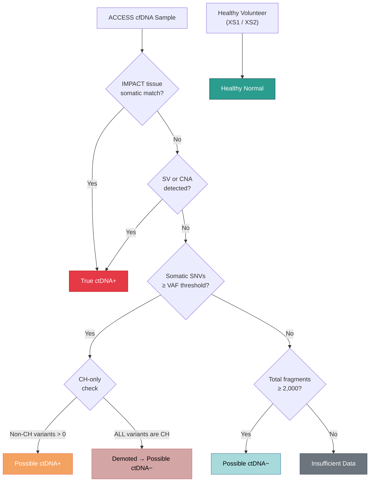

# ctDNA Labeling Engine

`kreview` evaluates computational fragmentomic features by measuring how accurately they distinguish tumor-derived circulating tumor DNA (ctDNA) from normal apoptotic background DNA.

To do this, it first establishes a rigid "Ground Truth" label matrix utilizing the `CtDNALabeler` engine (`kreview.labels`), relying strictly on MSK-IMPACT orthogonal tissue assays.

---

## 🔬 The Biological Assumption

Unlike standard genomics which calls somatic variants directly from the blood, **Fragmentomics** relies on subtle physical signatures—like fragment sizes, nucleosome imprints, and cleavage end-motifs—measured broadly across the entire epigenome.

Because we are evaluating *new* experimental fragmentomic models, we need incontrovertible proof that the patient sample actually *has* ctDNA present. For this, we look at **Variant Allele Frequency (VAF)**:

```math
VAF = \frac{\text{Alternate Allele Depth (t\_alt\_count)}}{\text{Total Depth (t\_ref\_count + t\_alt\_count)}}
```

If a sample contains somatic Single Nucleotide Variants (SNVs) with a high detectable VAF, or massive Copy Number Alterations (CNAs) / Structural Variants (SVs), then the physical tumor footprint in the blood is high.

---

## 🏷️ The 5-Tier Labeling Hierarchy



`kreview` assigns every sample one of five labels:

### 1. True ctDNA+

The gold standard. This label is granted **only** if one of three conditions is met:

- An SNV mutation detected in the blood cfDNA perfectly matches a somatic mutation detected in the patient's matched solid-tissue MSK-IMPACT biopsy.
- A macroscopic structural variant (SV) is positively called.
- Wide-scale somatic Copy Number Alterations (CNAs) are detected.

!!! note "True ctDNA+ overrides CH demotion"
    Even if a sample's only SNVs are CH hotspot mutations, it is still promoted to True ctDNA+ if it has an IMPACT tissue match, SV, or CNA. The CH filter only affects the Possible ctDNA+ tier.

### 2. Possible ctDNA+

The silver standard. The sample lacks a matched MSK-IMPACT tissue biopsy (or the biopsy was negative), but the ACCESS assay still detected somatic SNVs passing the configured stringency threshold:

```math
VAF \ge 0.01 \quad \text{and} \quad n_{variants} \ge 1
```

!!! info "Configurable Thresholds"
    These defaults are configurable via the CLI flags `--min-vaf` and `--min-variants`, or directly through the `LabelConfig` dataclass.

### 3. Possible ctDNA−

Symptomatic cancer patients whose blood cfDNA draws generated zero signal: **No SNVs, No SVs, No CNAs**. While they have cancer, their systemic shedding rate is too low for traditional orthogonal validation.

### 4. Healthy Normal

True negative controls. Drawn entirely from the MSK `XS1` and `XS2` healthy volunteer sequencing runs. Their data establishes the baseline apoptotic fragmentation profile.

### 5. Insufficient Data

!!! warning "QC Gate"
    If a cancer sample shows absolutely **no** positive signal (no SNVs, no SVs, no CNAs), **AND** their sequencing coverage yielded fewer than `min_fragments` total fragments (default: 2,000), the pipeline assigns them to this bucket instead of `Possible ctDNA−`.

    These samples are entirely excluded from the ML algorithms so low-depth noise doesn't corrupt the models.

---

## 🧬 Clonal Hematopoiesis (CH) Hotspot Filtering

**Clonal hematopoiesis of indeterminate potential (CHIP)** is a common age-related phenomenon where hematopoietic stem cells acquire somatic mutations — particularly in genes like *DNMT3A*, *TET2*, and *ASXL1*. These mutations are detectable in cfDNA but originate from the **blood lineage**, not from a solid tumor.

Without filtering, CH mutations contaminate the labeling pipeline: a sample whose only somatic evidence is a DNMT3A R882H hotspot would be erroneously labeled `Possible ctDNA+`, even though no tumor-derived DNA is present.

### How CH Filtering Works

When `--ch-hotspot-maf` is provided, the pipeline applies a three-step process:

#### Step 1: Load CH Hotspot Reference

The CH MAF file (TSV) contains known clonal hematopoiesis hotspot variants. Each row is converted to a `(Chromosome, Start_Position, Reference_Allele, Tumor_Seq_Allele2)` lookup key:

```
# Example CH hotspot MAF (tab-separated):
Hugo_Symbol  Chromosome  Start_Position  Reference_Allele  Tumor_Seq_Allele2
DNMT3A       2           25234373        G                 A
TET2         4           106164765       C                 T
ASXL1        20          32434638        G                 T
```

#### Step 2: Tag & Count

During SNV summary computation, each somatic variant is checked against the CH hotspot set. Two new counters are produced per sample:

| Column | Description |
|--------|-------------|
| `n_ch_variants` | Number of VAF-passing variants matching a CH hotspot |
| `n_non_ch_variants` | Number of VAF-passing variants that are **not** CH hotspots |

#### Step 3: CH-Only Demotion

After the initial label assignment, any sample meeting **all four** of these conditions is demoted from `Possible ctDNA+` back to `Possible ctDNA−`:

```
IF label == "Possible ctDNA+"
   AND n_non_ch_variants == 0        (ALL variants are CH)
   AND has_impact_match == False     (no IMPACT tissue confirmation)
   AND has_sv == False               (no structural variants)
   AND has_cna == False              (no copy number alterations)
THEN → demote to "Possible ctDNA−"
```

!!! important "Demotion is conservative"
    - If **any** non-CH variant exists (`n_non_ch_variants > 0`), the sample retains its `Possible ctDNA+` label.
    - If the sample has an IMPACT match, SV, or CNA, it is promoted to `True ctDNA+` regardless of CH status.
    - Demotion only affects the `Possible ctDNA+` tier — never `True ctDNA+`.

!!! tip "When to use CH filtering"
    CH filtering is **recommended for production cohorts** where elderly patients with CHIP may inflate the positive class. Pass the `--ch-hotspot-maf` flag to `kreview label`, `kreview extract`, or `kreview run`:
    ```bash
    kreview run \
      --cancer-samplesheet ... \
      --ch-hotspot-maf /path/to/ch_hotspots.maf
    ```

---

## 📊 Label Distribution

A typical production cohort produces a distribution like:

| Label | Typical % | ML Role |
|-------|-----------|---------|
| True ctDNA+ | ~25% | Positive class (highest confidence) |
| Possible ctDNA+ | ~35% | Positive class (medium confidence) |
| Possible ctDNA− | ~15% | Excluded or negative class |
| Healthy Normal | ~20% | Negative class (control baseline) |
| Insufficient Data | ~5% | Excluded from ML |

!!! tip "Binary Classification"
    For the ML pipeline, `True ctDNA+` and `Possible ctDNA+` are merged into a single binary positive class. `Healthy Normal` serves as the negative class. `Possible ctDNA−` and `Insufficient Data` are excluded.

---

## 📈 Continuous VAF Statistics

In addition to discrete labels, `kreview` computes continuous VAF statistics per sample and stores them in `labels.parquet`:

| Column | Description |
|--------|-------------|
| `max_vaf` | Highest VAF among all somatic variants |
| `mean_vaf` | Mean VAF across VAF-passing variants only |
| `std_vaf` | Standard deviation of VAF across VAF-passing variants |

These columns are used for **diagnostic auditing** (e.g. verifying that True ctDNA+ samples have higher VAF than Possible ctDNA+) and are available for future regression modeling.
