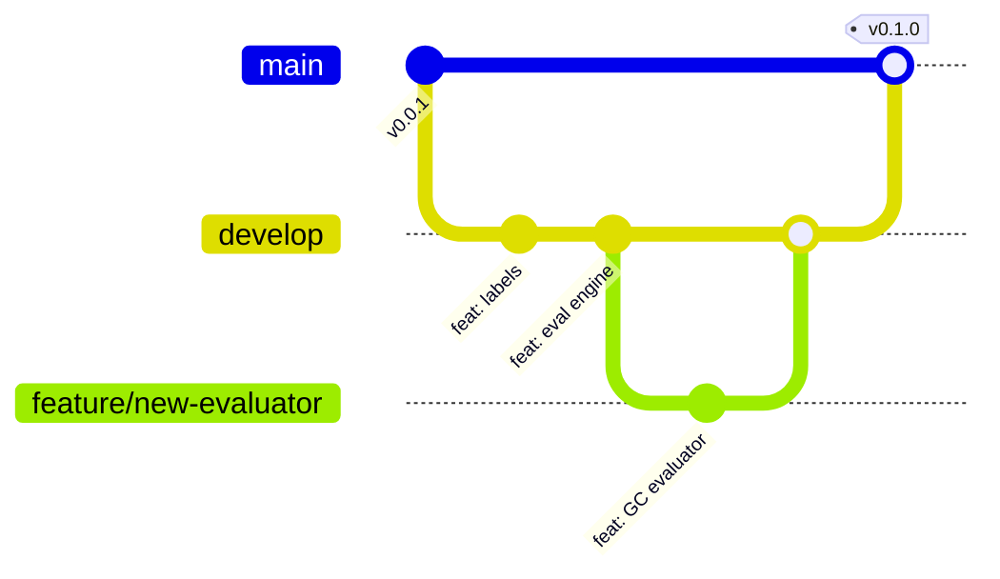

# Contributing Guide

Thank you for your interest in contributing to `kreview`! This guide covers everything you need to get started.

---

## 🔀 Git Branching Model

We use a simplified **Git Flow** strategy:



| Branch | Purpose |
|--------|---------|
| `main` | Production-ready releases only. Protected. |
| `develop` | Integration branch. All PRs target here. |
| `feature/*` | Short-lived branches for individual features/fixes. |

---

## 📝 Commit Convention

We follow **[Conventional Commits](https://www.conventionalcommits.org/)**:

```
type(scope): short description

Optional body with more context.
```

| Type | When to use |
|------|-------------|
| `feat` | A new feature or evaluator |
| `fix` | A bug fix |
| `docs` | Documentation changes only |
| `refactor` | Code change that neither fixes a bug nor adds a feature |
| `test` | Adding or updating tests |
| `ci` | CI/CD workflow changes |
| `chore` | Maintenance (deps, config, cleanup) |

**Examples:**
```bash
git commit -m "feat(labels): add Insufficient Data tier for low-depth samples"
git commit -m "fix(duckdb): add exponential backoff retry for transient I/O failures"
git commit -m "docs(biology): update feature count to 26 evaluators"
```

---

## 🔧 Development Setup

```bash
git clone https://github.com/msk-access/kreview.git
cd kreview
pip install -e '.[dev,test,docs]'
nbdev-install-hooks
pre-commit install
```

---

## ⛔ The Golden Rule

!!! danger "Never edit `.py` files directly"
    All Python files in `kreview/*.py` are auto-generated by `nbdev` from the Jupyter notebooks in `nbs/`. If you need to change code:

    1. Edit the corresponding notebook in `nbs/`
    2. Run `nbdev-export` to regenerate the `.py` files
    3. If you accidentally edited a `.py` file, run `nbdev-update` to sync backwards

---

## ✅ Pull Request Checklist

Before submitting a PR, make sure you've completed all of these:

- [ ] Code changes are made in `nbs/*.ipynb` (not `.py` files)
- [ ] `nbdev-export` has been run and `.py` files are in sync
- [ ] `nbdev-clean` has been run to strip notebook metadata
- [ ] `ruff check kreview/` passes with no errors
- [ ] `black kreview/` has been run (formatting)
- [ ] `pytest --cov=kreview` passes
- [ ] Documentation is updated if public APIs changed
- [ ] Commit messages follow Conventional Commits format
- [ ] PR targets the `develop` branch (not `main`)

---

## 🔍 Code Review Standards

PRs are reviewed for:

1. **Correctness:** Does the code do what it claims?
2. **Biological accuracy:** Are domain assumptions valid?
3. **Observability:** Are failures logged explicitly (no silent `except: pass`)?
4. **Test coverage:** Are edge cases covered?
5. **Documentation:** Are docstrings and docs pages updated?

---

## 🧪 Pre-commit Hooks

The following hooks run automatically on every commit:

| Hook | Purpose |
|------|---------|
| `trailing-whitespace` | Removes trailing whitespace |
| `end-of-file-fixer` | Ensures files end with a newline |
| `check-yaml` | Validates YAML syntax |
| `check-added-large-files` | Prevents committing large binaries |
| `ruff` | Python linting with auto-fix |
| `nbqa-black` | Black formatting inside notebooks |
| `nbqa-ruff` | Ruff linting inside notebooks |
