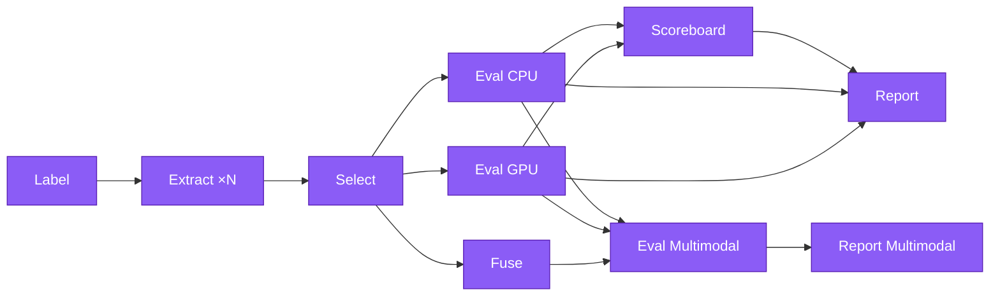

# Pipeline Architecture

This document describes the decomposed pipeline architecture of `kreview`, how commands share code through the nbdev notebook-first workflow, and how to add a new pipeline stage.

---

## Pipeline Overview

The `kreview` pipeline is decomposed into independent stages that can run either sequentially (`kreview run`) or in parallel (Nextflow / HPC):



!!! note "Parallel execution"
    After feature selection, `eval cpu`, `eval gpu`, and `fuse` run in **parallel**.
    After eval, `scoreboard`, `report`, and `eval multimodal` run in **parallel** — Scoreboard needs all JSONs; Report needs matrices + model results + scoreboard; Multimodal needs super_matrix + OOF probs.

---

## Command → Module → Notebook Mapping

Every module in `kreview` is auto-generated from an nbdev notebook in `nbs/`. **Never manually edit the `.py` files** (see [nbdev Workflow](nbdev-workflow.md)).

| CLI Command | Module | Source Notebook | Purpose |
|-------------|--------|-----------------|---------|
| `kreview label` | `cli.py:label()` | `nbs/90_cli.ipynb` | Generate ctDNA labels |
| `kreview extract` | `cli.py:extract()` | `nbs/90_cli.ipynb` | Label + extract feature matrices |
| `kreview select` | `cli_select.py:select()` | `nbs/92_cli_select.ipynb` | Score features + mRMR/hybrid-union selection |
| `kreview eval cpu` | `cli_eval.py:eval_cpu()` | `nbs/91_cli_eval.ipynb` | CPU model evaluation (LR, RF, XGB) |
| `kreview eval gpu` | `cli_eval.py:eval_gpu()` | `nbs/91_cli_eval.ipynb` | GPU model evaluation (TabPFN, TabICL) |
| `kreview fuse` | `cli.py:fuse()` | `nbs/90_cli.ipynb` | Fuse per-evaluator matrices → super-matrix |
| `kreview eval multimodal` | `cli_eval.py:eval_multimodal()` | `nbs/91_cli_eval.ipynb` | Cross-evaluator stacking + ablation |
| `kreview report` | `cli.py:report()` | `nbs/90_cli.ipynb` | Re-generate HTML dashboards |
| `kreview run` | `cli.py:run()` | `nbs/90_cli.ipynb` | Full pipeline orchestrator |
| `kreview features-list` | `cli.py:features_list()` | `nbs/90_cli.ipynb` | List registered evaluators |

### Shared Libraries

| Module | Source Notebook | Functions | Used By |
|--------|-----------------|-----------|---------|
| `selection.py` | `nbs/04_selection.ipynb` | `score_features()`, `select_features()`, `build_binary_target()` | `kreview run`, `kreview select` |
| `eval_engine.py` | `nbs/02_eval_engine.ipynb` | `cpu_models()`, `gpu_models()`, `univariate_auc()`, `mutual_info_score()`, `load_model_results()`, `load_all_model_results()` | `kreview run`, `kreview eval cpu/gpu`, `selection.py`, `scoreboard.py`, report templates |
| `scoreboard.py` | Standalone | `build_scoreboard()` | `kreview report`, `KREVIEW_SCOREBOARD` |
| `core.py` | `nbs/00_core.ipynb` | `LABEL_META_COLS`, `Paths`, `LabelConfig` | All commands |
| `registry.py` | `nbs/03_registry.ipynb` | `get_all_evaluators()` | `kreview run`, `kreview extract`, `kreview features-list` |

---

## Shared Code Principle

`kreview run` is an **orchestrator** — it calls the same shared functions as the standalone commands. This guarantees that local runs and HPC runs produce **identical results** given the same inputs.

```python
# selection.py — used by BOTH kreview run AND kreview select
from kreview.selection import score_features, select_features

# eval_engine.py — used by BOTH kreview run AND kreview eval cpu/gpu
from kreview.eval_engine import cpu_models, gpu_models
```

When editing these shared functions, always edit the **source notebook** (`nbs/*.ipynb`) and run `nbdev_export` to regenerate the `.py` modules.

---

## Data Flow

Each stage communicates through **parquet files** on disk:

```
Label:    → labels.parquet  (5-tier ctDNA labels)
Extract:  → {evaluator}_matrix.parquet  (full features)
Select:   → {evaluator}_matrix.parquet  (selected features, overwrites)
          → {evaluator}_eval_stats.parquet  (per-feature scores for ALL features)
          → {evaluator}_selection_qc.json  (selection audit trail)
Eval CPU: → {evaluator}_model_results.json  (AUCs, OOF probs)
          → {evaluator}_{model}_model.joblib  (trained models)
Eval GPU: → {evaluator}_gpu_model_results.json  (GPU AUCs, OOF probs)
Fuse:     → super_matrix.parquet  (wide join on SAMPLE_ID)
Scoreboard: → scoreboard_combined__all.parquet  (cross-evaluator rankings)
Multimodal: → multimodal_results.json  (stacking + ablation results)
Report:   → reports/{evaluator}.html  (interactive dashboards)
```

---

## Nextflow Parallelism

See [Nextflow Integration](../operations/nextflow.md) for full HPC execution docs.

In Nextflow multistage mode (`params.pipeline_mode = 'multistage'`), the DAG executes as:

```
LABEL (1 job) → EXTRACT ×N → SELECT ×N ──┬── EVAL_CPU ──┬── EVAL_MULTIMODAL
                                           ├── EVAL_GPU ──┤
                                           └── FUSE ──────┘
                                                          └── REPORT (parallel)
```

Each stage is a separate Nextflow process in `nextflow/modules/local/kreview/`:

| Process | Module | Input | Output | publishDir |
|---------|--------|-------|--------|------------|
| `KREVIEW_LABEL` | `label.nf` | Samplesheets + cBioPortal | `labels.parquet` | `outdir/labels/` |
| `KREVIEW_EXTRACT` | `extract.nf` | Samplesheets + labels.parquet | `*_matrix.parquet` | `outdir/matrices/raw/` |
| `KREVIEW_SELECT_SINGLE` | `select_single.nf` | Raw matrix | Selected matrix + stats + QC | `outdir/matrices/selected/` |
| `KREVIEW_EVAL_CPU_SINGLE` | `eval_cpu_single.nf` | Selected matrix | `*_model_results.json` + `*.joblib` | `outdir/models/cpu/` |
| `KREVIEW_EVAL_GPU_SINGLE` | `eval_gpu_single.nf` | Selected matrix | `*_gpu_model_results.json` + `*.joblib` | `outdir/models/gpu/` |
| `KREVIEW_FUSE` | `fuse.nf` | All selected matrices | `super_matrix.parquet` | `outdir/matrices/fused/` |
| `KREVIEW_SCOREBOARD` | `scoreboard.nf` | Collected CPU + GPU JSONs | `scoreboard_combined__all.parquet` | `outdir/` |
| `KREVIEW_EVAL_MULTIMODAL` | `eval_multimodal.nf` | Fuse + eval results | Multimodal results | `outdir/models/multimodal/` |
| `KREVIEW_REPORT` | `report.nf` | Matrices + JSONs + stats + QC + joblib + scoreboard | HTML dashboards | `outdir/reports/` |
| `KREVIEW_REPORT_MULTIMODAL` | `report_multimodal.nf` | Multimodal JSON + super_matrix | Multimodal dashboard | `outdir/reports/` |

---

## Adding a New Pipeline Stage

1. **Create the source notebook** (e.g., `nbs/04_new_stage.ipynb`) with the shared logic functions
2. Run `nbdev_export` to generate `kreview/new_stage.py`
3. **Create a CLI notebook** (e.g., `nbs/93_cli_new_stage.ipynb`) with the thin CLI wrapper
4. Run `nbdev_export` to generate `kreview/cli_new_stage.py`
5. Register in `nbs/90_cli.ipynb` via `app.command()` or `app.add_typer()`
6. Update `kreview run` in the same notebook to call the shared functions
7. Create a Nextflow process in `nextflow/modules/local/kreview/new_stage.nf`
8. Wire into `nextflow/workflows/kreview_eval.nf`
9. Add tests in `tests/test_new_stage.py`
10. Update this document and [Pipeline CLI](../getting-started/pipeline-cli.md)

!!! warning "Remember the Golden Rule"
    Always edit the **notebook** first, then `nbdev_export`. See [nbdev Workflow](nbdev-workflow.md) for details.
