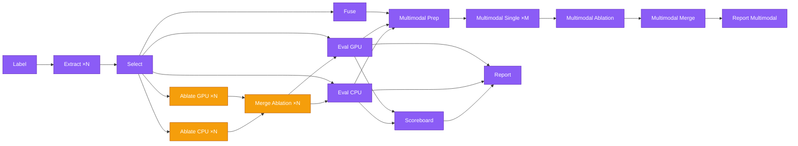

# Pipeline Architecture

This document describes the decomposed pipeline architecture of `kreview`, how commands share code through the nbdev notebook-first workflow, and how to add a new pipeline stage.

---

## Pipeline Overview

The `kreview` pipeline is decomposed into independent stages that can run either sequentially (`kreview run`) or in parallel (Nextflow / HPC):



!!! note "Parallel execution"
    After feature selection, `eval cpu`, `eval gpu`, and `fuse` run in **parallel**.
    After eval, `scoreboard` and `report` run in **parallel**.
    The multimodal pipeline is **decomposed**: `prep` builds the stacking matrix, `single` trains per-model stacking classifiers (parallelized across models), `ablation` runs feature ablation, and `merge` aggregates final results.
    The legacy monolithic `kreview eval multimodal run` can also execute the full pipeline as a single step.

!!! tip "Feature Group Ablation (v0.0.20+, optional)"
    When `params.run_ablation = true`, the ABLATE stages (shown in amber) run between SELECT and EVAL. They use nested inner CV to identify the best feature group subset per model, producing a `best_subset.json` that EVAL consumes via `--best-subset`. When `run_ablation = false` (default), EVAL runs directly after SELECT with all selected features.

---

## Command → Module → Notebook Mapping

Every module in `kreview` is auto-generated from an nbdev notebook in `nbs/`. **Never manually edit the `.py` files** (see [nbdev Workflow](nbdev-workflow.md)).

| CLI Command | Module | Source Notebook | Purpose |
|-------------|--------|-----------------|---------|
| `kreview label` | `cli.py:label()` | `nbs/90_cli.ipynb` | Generate ctDNA labels |
| `kreview extract` | `cli.py:extract()` | `nbs/90_cli.ipynb` | Label + extract feature matrices |
| `kreview select` | `cli_select.py:select()` | `nbs/92_cli_select.ipynb` | Score features + mRMR/hybrid-union selection |
| `kreview eval ablate cpu` | `cli_eval.py:eval_ablate_cpu()` | `nbs/91_cli_eval.ipynb` | Nested CV feature group ablation (CPU) |
| `kreview eval ablate gpu` | `cli_eval.py:eval_ablate_gpu()` | `nbs/91_cli_eval.ipynb` | Nested CV feature group ablation (GPU) |
| `kreview eval ablate merge` | `cli_eval.py:eval_ablate_merge()` | `nbs/91_cli_eval.ipynb` | Merge CPU + GPU ablation → `best_subset.json` |
| `kreview eval cpu` | `cli_eval.py:eval_cpu()` | `nbs/91_cli_eval.ipynb` | CPU model evaluation (LR, RF, XGB) |
| `kreview eval gpu` | `cli_eval.py:eval_gpu()` | `nbs/91_cli_eval.ipynb` | GPU model evaluation (TabPFN, TabPFN-FT, TabICL, TabICL-FT) |
| `kreview fuse` | `cli.py:fuse()` | `nbs/90_cli.ipynb` | Fuse per-evaluator matrices → super-matrix |
| `kreview eval multimodal run` | `cli_eval.py:multimodal_run()` | `nbs/91_cli_eval.ipynb` | Monolithic cross-evaluator stacking + ablation |
| `kreview eval multimodal prep` | `cli_eval.py:multimodal_prep()` | `nbs/91_cli_eval.ipynb` | Build stacking matrix + feature selection |
| `kreview eval multimodal single` | `cli_eval.py:multimodal_single()` | `nbs/91_cli_eval.ipynb` | Train single stacking model (parallelizable) |
| `kreview eval multimodal ablation` | `cli_eval.py:multimodal_ablation()` | `nbs/91_cli_eval.ipynb` | Feature ablation analysis |
| `kreview eval multimodal merge` | `cli_eval.py:multimodal_merge()` | `nbs/91_cli_eval.ipynb` | Aggregate stacking + ablation results |
| `kreview report` | `cli.py:report()` | `nbs/90_cli.ipynb` | Re-generate HTML dashboards |
| `kreview run` | `cli.py:run()` | `nbs/90_cli.ipynb` | Full pipeline orchestrator |
| `kreview features-list` | `cli.py:features_list()` | `nbs/90_cli.ipynb` | List registered evaluators |

### Shared Libraries

| Module | Source Notebook | Functions | Used By |
|--------|-----------------|-----------|---------|
| `selection.py` | `nbs/04_selection.ipynb` | `score_features()`, `select_features()`, `build_binary_target()`, `MODEL_LABELS`, `POSITIVE_LABELS` | `kreview run`, `kreview select`, report templates |
| `eval_engine.py` | `nbs/02_eval_engine.ipynb` | `cpu_models()`, `gpu_models()`, `univariate_auc()`, `mutual_info_score()`, `load_model_results()`, `load_all_model_results()`, `identify_feature_groups()`, `generate_subsets()`, `ablate_feature_groups()`, `merge_ablation()`, `_compute_oof_metrics()`, `multimodal_prep()`, `multimodal_single()`, `multimodal_ablation()`, `multimodal_merge()` | `kreview run`, `kreview eval cpu/gpu`, `kreview eval ablate *`, `kreview eval multimodal *`, `selection.py`, `scoreboard.py`, report templates |
| `scoreboard.py` | Standalone | `build_scoreboard()` | `kreview report`, `KREVIEW_SCOREBOARD` |
| `core.py` | `nbs/00_core.ipynb` | `LABEL_META_COLS`, `Paths`, `LabelConfig` | All commands |
| `registry.py` | `nbs/03_registry.ipynb` | `get_all_evaluators()` | `kreview run`, `kreview extract`, `kreview features-list` |

---

## Shared Code Principle

`kreview run` is an **orchestrator** — it calls the same shared functions as the standalone commands. This guarantees that local runs and HPC runs produce **identical results** given the same inputs.

```python
# selection.py — used by BOTH kreview run AND kreview select
from kreview.selection import score_features, select_features

# eval_engine.py — used by BOTH kreview run AND kreview eval cpu/gpu
from kreview.eval_engine import cpu_models, gpu_models
```

When editing these shared functions, always edit the **source notebook** (`nbs/*.ipynb`) and run `nbdev_export` to regenerate the `.py` modules.

---

## Data Flow

Each stage communicates through **parquet files** on disk:

```
Label:    → labels.parquet  (5-tier ctDNA labels + train/test split column)
Extract:  → {evaluator}_matrix.parquet  (full features)
Select:   → {evaluator}_matrix.parquet  (selected features, overwrites)
          → {evaluator}_eval_stats.parquet  (per-feature scores for ALL features)
          → {evaluator}_selection_qc.json  (selection audit trail)
Ablate CPU:  → {evaluator}_ablation_cpu_results.json  (per-fold best subsets for LR/RF/XGB)
Ablate GPU:  → {evaluator}_ablation_gpu_results.json  (per-fold best subsets for TabPFN/TabICL)
Merge Ablation: → {evaluator}_best_subset.json  (merged per-model-per-fold winning features + fold_assignment)
Eval CPU: → {evaluator}_model_results.json  (AUCs, OOF probs)
          → {evaluator}_{model}_model.joblib  (trained models)
Eval GPU: → {evaluator}_gpu_model_results.json  (all GPU model AUCs + OOF probs in one JSON)
Fuse:     → super_matrix.parquet  (wide join on SAMPLE_ID)
Scoreboard: → scoreboard_combined__all.parquet  (cross-evaluator rankings)
Multimodal Prep:     → stacking_matrix.parquet  (OOF probs from all evaluators)
                     → prep_metadata.json  (feature names, selection QC)
Multimodal Single:   → stacking_{model}_results.json  (per-model stacking CV)
Multimodal Ablation: → ablation_results.json  (feature ablation analysis)
Multimodal Merge:    → multimodal_model_results.json  (final aggregated results)
Report:   → reports/{evaluator}.html  (interactive dashboards)
```

---

## Nextflow Parallelism

See [Nextflow Integration](../operations/nextflow.md) for full HPC execution docs.

In Nextflow multistage mode (`params.pipeline_mode = 'multistage'`), the DAG executes as:

```
LABEL (1 job) → EXTRACT ×N → SELECT ×N ──┬── [ABLATE_CPU ×N] ──┬── EVAL_CPU ────┬── MULTIMODAL_PREP
                                          ├── [ABLATE_GPU ×N] ──┤      (optional)  ├── EVAL_GPU ────┤
                                          │  [MERGE_ABLATION] ──┘                  └── FUSE ────────┘
                                          │                                               ↓
                                          │                                    MULTIMODAL_SINGLE ×M
                                          │                                               ↓
                                          │                                    MULTIMODAL_ABLATION
                                          │                                               ↓
                                          │                                     MULTIMODAL_MERGE
                                          │                                               ↓
                                          │                                     REPORT_MULTIMODAL
                                          └── SCOREBOARD ───────── REPORT (parallel)
```

!!! info "Optional Ablation Stages (v0.0.20+)"
    The `[ABLATE_CPU]`, `[ABLATE_GPU]`, and `[MERGE_ABLATION]` stages are optional and controlled by `params.run_ablation` (default: `false`). When disabled, EVAL runs directly after SELECT with all selected features. When enabled, MERGE produces a `best_subset.json` consumed by EVAL via `--best-subset`.

!!! info "Legacy Monolithic Module"
    The original `KREVIEW_EVAL_MULTIMODAL` module (`eval_multimodal.nf`) is kept for standalone testing. It uses `kreview eval multimodal run` to execute the full pipeline in a single process.

Each stage is a separate Nextflow process in `nextflow/modules/local/kreview/`:

| Process | Module | Input | Output | publishDir |
|---------|--------|-------|--------|------------|
| `KREVIEW_LABEL` | `label.nf` | Samplesheets + cBioPortal | `labels.parquet` | `outdir/labels/` |
| `KREVIEW_EXTRACT` | `extract.nf` | Samplesheets + labels.parquet | `*_matrix.parquet` | `outdir/matrices/raw/` |
| `KREVIEW_SELECT_SINGLE` | `select_single.nf` | Raw matrix | Selected matrix + stats + QC | `outdir/matrices/selected/` |
| `KREVIEW_ABLATE_CPU_SINGLE` | `ablate_cpu_single.nf` | Selected matrix + labels | `*_ablation_cpu_results.json` | `outdir/models/ablation/` |
| `KREVIEW_ABLATE_GPU_SINGLE` | `ablate_gpu_single.nf` | Selected matrix + labels + eval_stats | `*_ablation_gpu_results.json` | `outdir/models/ablation/` |
| `KREVIEW_MERGE_ABLATION` | `merge_ablation.nf` | CPU + GPU ablation JSONs | `*_best_subset.json` | `outdir/models/ablation/` |
| `KREVIEW_EVAL_CPU_SINGLE` | `eval_cpu_single.nf` | Selected matrix + best_subset | `*_model_results.json` + `*.joblib` | `outdir/models/cpu/` |
| `KREVIEW_EVAL_GPU_SINGLE` | `eval_gpu_single.nf` | Selected matrix + eval_stats + best_subset | `*_gpu_model_results.json` + `*.joblib` | `outdir/models/gpu/` |
| `KREVIEW_FUSE` | `fuse.nf` | All selected matrices | `super_matrix.parquet` | `outdir/matrices/fused/` |
| `KREVIEW_SCOREBOARD` | `scoreboard.nf` | Collected CPU + GPU JSONs | `scoreboard_combined__all.parquet` | `outdir/` |
| `KREVIEW_MULTIMODAL_PREP` | `multimodal_prep.nf` | Eval results + super_matrix | `stacking_matrix.parquet` + `prep_metadata.json` | `outdir/models/multimodal/` |
| `KREVIEW_MULTIMODAL_SINGLE_CPU` | `multimodal_single.nf` | Stacking matrix + model name | `stacking_{model}_results.json` | `outdir/models/multimodal/` |
| `KREVIEW_MULTIMODAL_SINGLE_GPU` | `multimodal_single.nf` | Stacking matrix + GPU model name | `stacking_{model}_results.json` | `outdir/models/multimodal/` |
| `KREVIEW_MULTIMODAL_ABLATION` | `multimodal_ablation.nf` | Stacking matrix + stacking results | `ablation_results.json` | `outdir/models/multimodal/` |
| `KREVIEW_MULTIMODAL_MERGE` | `multimodal_merge.nf` | All stacking + ablation results | `multimodal_model_results.json` | `outdir/models/multimodal/` |
| `KREVIEW_REPORT` | `report.nf` | Matrices + JSONs + stats + QC + joblib + scoreboard | HTML dashboards | `outdir/reports/` |
| `KREVIEW_REPORT_MULTIMODAL` | `report_multimodal.nf` | Multimodal JSON + super_matrix | Multimodal dashboard | `outdir/reports/` |
| `KREVIEW_EVAL_MULTIMODAL` | `eval_multimodal.nf` | Fuse + eval results | Multimodal results | `outdir/models/multimodal/` | *(Legacy — standalone testing)* |

---

## Adding a New Pipeline Stage

1. **Create the source notebook** (e.g., `nbs/04_new_stage.ipynb`) with the shared logic functions
2. Run `nbdev_export` to generate `kreview/new_stage.py`
3. **Create a CLI notebook** (e.g., `nbs/93_cli_new_stage.ipynb`) with the thin CLI wrapper
4. Run `nbdev_export` to generate `kreview/cli_new_stage.py`
5. Register in `nbs/90_cli.ipynb` via `app.command()` or `app.add_typer()`
6. Update `kreview run` in the same notebook to call the shared functions
7. Create a Nextflow process in `nextflow/modules/local/kreview/new_stage.nf`
8. Wire into `nextflow/workflows/kreview_eval.nf`
9. Add tests in `tests/test_new_stage.py`
10. Update this document and [Pipeline CLI](../getting-started/pipeline-cli.md)

!!! warning "Remember the Golden Rule"
    Always edit the **notebook** first, then `nbdev_export`. See [nbdev Workflow](nbdev-workflow.md) for details.
