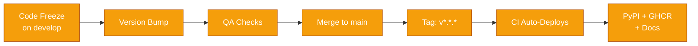

# Release Guide

This document walks through the complete release process from code freeze to published artifacts.

---

## Release Pipeline Overview



When a `v*.*.*` tag is pushed, CI automatically publishes:

1. **GitHub Release** with `.whl` artifacts
2. **PyPI** via OIDC Trusted Publishing (zero tokens)
3. **GHCR Docker Image** tagged as `latest` and versioned
4. **MkDocs** versioned documentation via `mike`

---

## Step-by-Step Release Checklist

### 1. Ensure Notebooks Are Clean

- [ ] All code changes are in `nbs/*.ipynb`
- [ ] Run `nbdev-export` to sync `.py` files
- [ ] Run `nbdev-clean` to strip metadata

```bash
nbdev-export
nbdev-clean
```

### 2. Run Full QA Suite

- [ ] Linting passes
- [ ] Tests pass
- [ ] Docs build cleanly

```bash
ruff check kreview/
black --check kreview/
pytest --cov=kreview
mkdocs build --strict
```

### 3. Bump Version

Update the version in two places:

=== "settings.ini"

    ```ini
    version = 0.1.0
    ```

=== "kreview/__init__.py"

    ```python
    __version__ = "0.1.0"
    ```

### 4. Commit and Merge

```bash
git add -A
git commit -m "chore(release): bump version to 0.1.0"
git push origin develop
```

Then create a PR from `develop` → `main` and merge after review.

### 5. Tag and Push

!!! warning "This triggers CI deployment"
    Pushing a tag will automatically publish to PyPI, GHCR, and deploy versioned docs. Make sure the `main` branch is clean!

```bash
git checkout main
git pull origin main
git tag v0.1.0
git push origin v0.1.0
```

### 6. Post-Release

- [ ] Verify the [PyPI page](https://pypi.org/project/kreview/) shows the new version
- [ ] Verify the [GHCR package](https://github.com/msk-access/kreview/pkgs/container/kreview) has the new tag
- [ ] Verify the [docs site](https://msk-access.github.io/kreview/) shows the versioned release
- [ ] Back-merge `main` into `develop`:

```bash
git checkout develop
git merge main
git push origin develop
```
