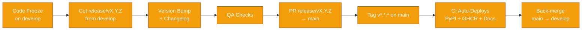

# Release Guide

This document walks through the complete release process from code freeze to published artifacts.

---

## Release Pipeline Overview


```mermaid
flowchart LR
    classDef step fill:#f59e0b,stroke:#b45309,color:#fff;
    A["Code Freeze\non develop"]:::step --> B["Cut release/vX.Y.Z\nfrom develop"]:::step
    B --> C["Version Bump\n+ Changelog"]:::step
    C --> D["QA Checks"]:::step
    D --> E["PR release/vX.Y.Z\n→ main"]:::step
    E --> F["Tag v*.*.* on main"]:::step
    F --> G["CI Auto-Deploys\nPyPI + GHCR + Docs"]:::step
    G --> H["Back-merge\nmain → develop"]:::step
```

When a `v*.*.*` tag is pushed, CI automatically publishes:

1. **GitHub Release** with `.whl` artifacts
2. **PyPI** via OIDC Trusted Publishing (zero tokens)
3. **GHCR Docker Image** tagged as `latest` and versioned
4. **MkDocs** versioned documentation via `mike`

---

## Step-by-Step Release Checklist

### 1. Ensure Notebooks Are Clean

- [ ] All code changes are in `nbs/*.ipynb`
- [ ] Run `nbdev-export` to sync `.py` files
- [ ] Run `nbdev-clean` to strip metadata

```bash
nbdev-export
nbdev-clean
```

### 2. Run Full QA Suite

- [ ] Linting passes
- [ ] Tests pass
- [ ] Docs build cleanly

```bash
ruff check kreview/
black --check kreview/
pytest --cov=kreview
mkdocs build --strict
```

### 3. Bump Version

Update the version in three places:

=== "settings.ini"

    ```ini
    version = 0.1.0
    ```

=== "kreview/__init__.py"

    ```python
    __version__ = "0.1.0"
    ```

=== "nextflow/nextflow.config"

    ```groovy
    kreview_version = '0.1.0'
    ```

### 4. Commit and Merge

!!! warning "The release branch merges into `main`, never into `develop`"
    This is git-flow, and it is what every release in this repository has actually done —
    `release/v0.0.32`, `release/v0.0.31` and `release/v0.0.28` each merged straight into
    `main` and were then back-merged (see step 6). Do **not** land the bump on `develop` and
    then PR `develop` → `main`: anything a colleague merges into `develop` between the bump
    and that PR rides into the release without anyone reviewing it as part of the release.

Cut the release branch from `develop` — note the `v` prefix, which matches every existing
release branch — and commit the bump and changelog on it:

```bash
git checkout develop && git pull origin develop
git checkout -b release/v0.1.0
git add -A
git commit -m "chore(release): bump version to 0.1.0"
git push -u origin release/v0.1.0
```

Then open a PR from `release/v0.1.0` → **`main`** and merge after review and green CI.
Release-only fixes go on the release branch, so `develop` stays open for ordinary work.

### 5. Tag and Push

!!! warning "This triggers CI deployment"
    Pushing a tag will automatically publish to PyPI, GHCR, and deploy versioned docs. Make sure the `main` branch is clean!

```bash
git checkout main
git pull origin main
git tag v0.1.0
git push origin v0.1.0
```

Tag `main` after the release PR merges — never the release branch, and never `develop`.

### 6. Post-Release

- [ ] Verify the [PyPI page](https://pypi.org/project/kreview/) shows the new version
- [ ] Verify the [GHCR package](https://github.com/msk-access/kreview/pkgs/container/kreview) has the new tag
- [ ] Verify the [docs site](https://msk-access.github.io/kreview/) shows the versioned release
- [ ] Back-merge `main` into `develop` — by PR, matching #117, #114 and #106:

```bash
git checkout -b chore/back-merge-v0.1.0 main
git push -u origin chore/back-merge-v0.1.0
gh pr create --base develop --title "chore: back-merge main into develop after v0.1.0"
```

Without this, `develop` never receives the version bump and the next release starts from a
tree that disagrees with the published one.
