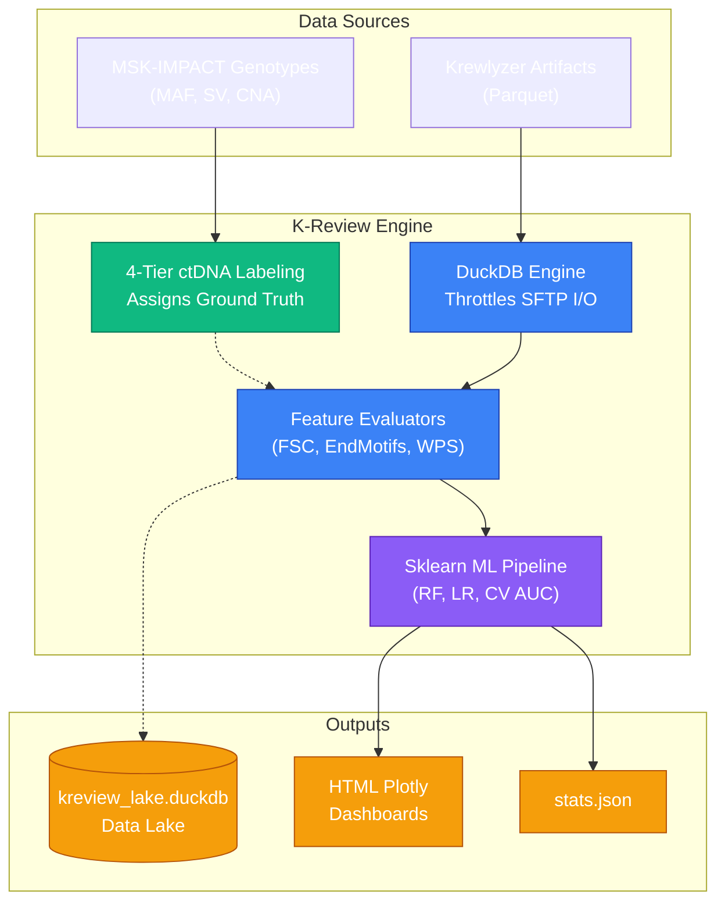

# Kreview: Scalable cfDNA Fragmentomics Evaluation

Welcome to the **kreview** evaluation intelligence platform. Built at MSKCC, `kreview` accelerates the downstream analysis of cell-free DNA (cfDNA) fragmentomics metrics generated by the Krewlyzer Rust pipeline.

Fragmentomics relies heavily on subtle biological properties—like where apoptotic DNA is cleaved by nucleases like DNASE1, or the differential length patterns generated by tumor-derived vs healthy hematopoietic cfDNA. `kreview` manages the high-throughput evaluation of these physical signals across large multi-thousand sample cohorts.

---

## 🏗️ Execution Architecture

At its core, `kreview` acts as an orchestration and machine learning engine. It seamlessly bridges raw analytical pipelines with massive DuckDB data lakes and statistical modeling. 

### What happens in a run?

1. **Ingest & Chunking:** `kreview` mounts the massive multi-terabyte parquet outputs of the upstream cluster. It uses throttled DuckDB queries to parse millions of rows over SFTP networks without overwhelming memory or socket limits.
2. **Gold Standard Labeling:** It accesses clinical MSK-IMPACT files to generate 4-tier truth labels (e.g., verifying if a somatic variant in cfDNA was also detected in the patient's matched solid tissue).
3. **Statistical Modeling:** It loads fragmentomics features dynamically, evaluating them against the ground truth using non-parametric group testing and balancing Random Forest evaluation engines.
4. **Interactive Insight:** It automatically constructs comprehensive HTML visualization dashboards so biologists can easily inspect the ROC-AUC diagnostics. 

---

## 🧬 Why Fragmentomics?
Traditional tumor profiling heavily targets Single Nucleotide Variants (SNVs). Fragmentomics unlocks orthogonal layers of diagnostic signal independently of genetic mutation status. 

By utilizing **kreview**, we systematically map:
- **Fragment Size Distribution (FSD & FSC):** Using lengths (e.g. fragments under 150bp) to find tumor properties.
- **Nucleosome Protection (WPS):** Tracing structurally bound or accessible transcription factor environments.
- **Cleavage Signatures (EndMotif & Breakpoints):** Profiling circulating end-cutting nuclease signatures.

➡️ **Ready to start?** Jump into our [Installation Guide](getting-started/installation.md) or explore the [CLI Pipeline](getting-started/pipeline-cli.md).
