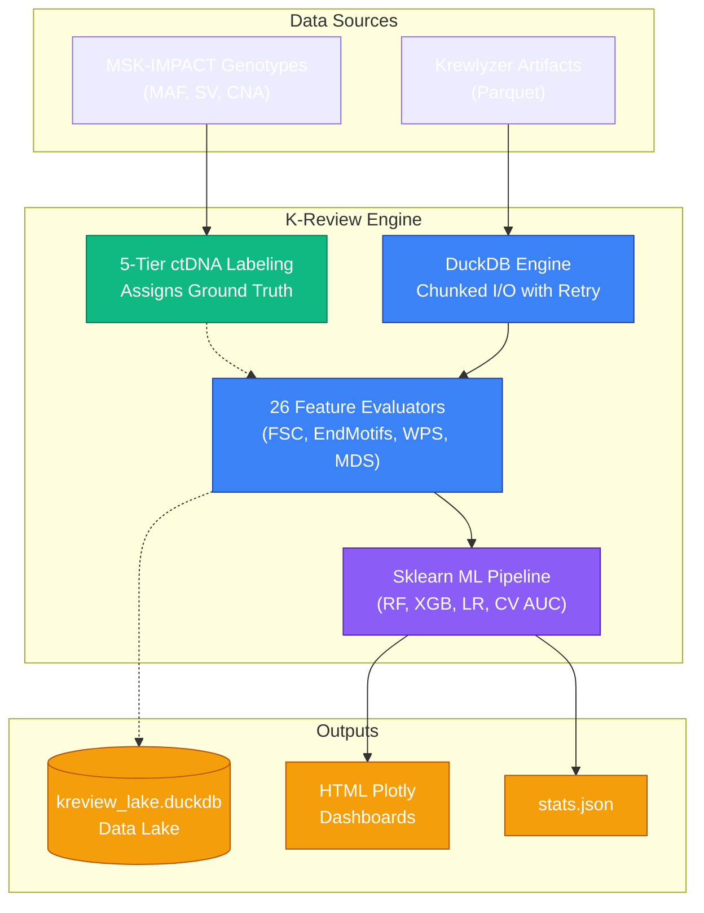
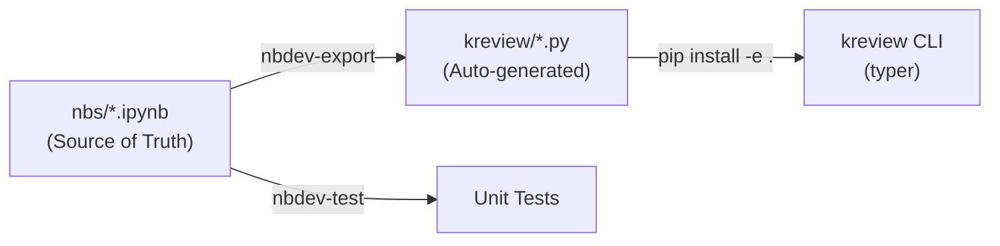

# Kreview: Scalable cfDNA Fragmentomics Evaluation

Welcome to the **kreview** evaluation intelligence platform. Built at MSKCC, `kreview` accelerates the downstream analysis of cell-free DNA (cfDNA) fragmentomics metrics generated by the [Krewlyzer](https://github.com/msk-access/krewlyzer) Rust pipeline.

Fragmentomics relies heavily on subtle biological properties—like where apoptotic DNA is cleaved by nucleases like DNASE1, or the differential length patterns generated by tumor-derived vs healthy hematopoietic cfDNA. `kreview` manages the high-throughput evaluation of these physical signals across large multi-thousand sample cohorts.

---

## 🏗️ Execution Architecture

At its core, `kreview` acts as an orchestration and machine learning engine. It seamlessly bridges raw analytical pipelines with DuckDB data lakes and statistical modeling. 

### What happens in a run?

1. **Ingest & Chunking:** `kreview` loads parquet outputs from the upstream Krewlyzer pipeline. It uses throttled DuckDB queries with exponential backoff retry to parse millions of rows reliably without overwhelming memory or socket limits.
2. **Gold Standard Labeling:** It accesses clinical MSK-IMPACT files to generate 5-tier truth labels (e.g., verifying if a somatic variant in cfDNA was also detected in the patient's matched solid tissue).
3. **Statistical Modeling:** It loads fragmentomics features dynamically, evaluating them against the ground truth using non-parametric group testing and ensemble ML evaluation (Random Forest, XGBoost, Logistic Regression).
4. **Interactive Insight:** It generates comprehensive 6-page HTML dashboards with progressive disclosure — from executive summary to SHAP explainability — so researchers can inspect diagnostic performance, clinical utility (DCA), and feature importance. See the [Dashboard Guide](machine-learning/dashboard-guide.md) for details.

---

## 🔬 Notebook-First Development

`kreview` is built using the **[nbdev](https://nbdev.fast.ai/)** notebook-first framework. All source code lives in Jupyter Notebooks (`nbs/`) and is automatically compiled into the Python package.

!!! danger "Golden Rule"
    **Never** manually edit files inside `kreview/*.py`. They are auto-generated from the notebooks. See the [nbdev Workflow](developer/nbdev-workflow.md) guide.

---

## 🧬 Why Fragmentomics?

Traditional tumor profiling heavily targets Single Nucleotide Variants (SNVs). Fragmentomics unlocks orthogonal layers of diagnostic signal independently of genetic mutation status. 

By utilizing **kreview**, we systematically map:

- **Fragment Size Distribution (FSD & FSC):** Using lengths (e.g. fragments under 150bp) to detect tumor properties.
- **Nucleosome Protection (WPS):** Tracing structurally bound or accessible transcription factor environments.
- **Cleavage Signatures (EndMotif & Breakpoints):** Profiling circulating end-cutting nuclease signatures.
- **Chromatin Accessibility (ATAC):** Evaluating openness at regulatory regions.
- **Motif Divergence (MDS):** Measuring shifts in end-motif distributions from healthy baselines.

➡️ **Ready to start?** Jump into our [Installation Guide](getting-started/installation.md) or explore the [CLI Pipeline](getting-started/pipeline-cli.md).
