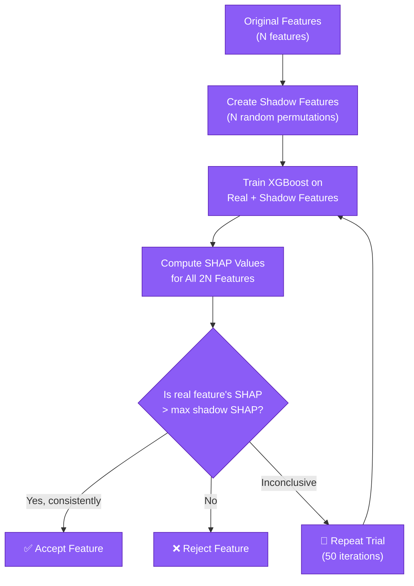

# Statistical Evaluation

Before feeding extracted feature matrix numbers into ensemble models, `kreview` utilizes native `scipy.stats` functionality executed in `evaluate_feature()`.

Our data almost never follows a clean parametric distribution, so we strictly use non-parametric tests.


---

## The 4-Way Omnibus Test (Kruskal-Wallis)

We group the sample's generated feature matrices by the 4 primary `CtDNALabeler` labels (`True ctDNA+`, `Possible ctDNA+`, `Possible ctDNA−`, `Healthy Normal`).

Because we are checking more than two independent samples to determine if they originate from the same distribution, we employ the **Kruskal-Wallis H-test** (`stats.kruskal`).

If the omnibus $p$-value is significant ($p < 0.05$), it suggests that the feature is stratifying *at least one* label group. Pairwise analysis then identifies which groups differ.

## Pairwise Separation (Mann-Whitney U)

We run five independent 2-sample **Mann-Whitney U** rank-sum tests:

| Pair | Clinical Question |
|------|-------------------|
| True ctDNA+ vs Healthy Normal | Can this feature distinguish confirmed cancer from healthy? |
| Possible ctDNA+ vs Healthy Normal | Does the signal extend to unconfirmed positives? |
| True ctDNA+ vs Possible ctDNA+ | Can it differentiate confirmed from uncertain? |
| Possible ctDNA− vs Healthy Normal | Is there any signal in likely-negative patients? |
| True ctDNA+ vs Possible ctDNA− | How strong is the full positive-negative gap? |

We additionally compute a **Rank-Biserial correlation** to understand the direction and magnitude of separation.

### Benjamini-Hochberg FDR Correction
Because `kreview` executes five independent pair-wise checks simultaneously, it introduces a significant multiple-testing problem. To prevent artificially inflated False Positive rates (p-hacking), the engine natively applies the **Benjamini-Hochberg Method** to wrap all 5 raw $p$-values. The generated `fdr_pvalue` arrays are what you should evaluate for true significance.

## Effect Size (Cohen's d)

As an accompaniment to strict \(p\)-values (which easily become inflated by large sample cohorts), we compute **Cohen's d**. This represents the standardized difference between two means (True+ vs Healthy):

```math
d = \frac{M_{1} - M_{2}}{SD_{pooled}}
```

| Cohen's d | Interpretation |
|-----------|---------------|
| \(d \ge 0.8\) | Large biological separation |
| \(0.5 \le d < 0.8\) | Medium separation |
| \(d < 0.5\) | Small or negligible |

## Confounder Tracking (Spearman Rank)

Fragmentomics logic is notorious for being accidentally driven by sequencing depth rather than actual biological shedding signals.

To prevent this, `evaluate_feature` independently extracts **Spearman Rank Correlations** mapping the generated feature against:

1. `max_vaf` — Is the feature actually scaling linearly with structural tumor burden?
2. `total_fragments` — Is the feature artificially inflating simply because a sample was sequenced to 4,000x depth?

!!! warning "High Spearman Depth Correlation"
    If `spearman_depth_r > 0.5`, the feature may be a sequencing artifact rather than a true biological signal. Interpret its AUC with caution.

## Per-Feature QC Metrics

In addition to statistical tests, `evaluate_feature()` computes three data quality fields for each feature:

| Metric | Field | Purpose |
|--------|-------|---------|
| Missing count | `n_missing` | Number of NaN values in the feature column |
| Missing percentage | `pct_missing` | Percentage of samples with NaN (0–100) |
| Zero variance | `is_zero_variance` | Whether `std == 0` after dropping NaN (constant feature) |

These metrics are saved to `*_eval_stats.parquet` and surfaced in the dashboard's [Cohort & QC page](../machine-learning/dashboard-guide.md#page-5-cohort--qc).

## Feature Selection Scoring (v0.0.9+)

After descriptive statistics are computed, kreview scores every feature using complementary methods to decide which features enter the downstream ML models. The default strategy is **mRMR**.

### Minimum Redundancy Maximum Relevance (mRMR) [Default]

The `strategy="mrmr"` method (via [`mrmr-selection`](https://github.com/smazzanti/mrmr)) iteratively selects features that maximize correlation with the target label (**relevance**) while minimizing correlation with already-selected features (**redundancy**).

#### Optimization Objective

At each step $i$, mRMR selects the feature $f_i$ that maximizes:

$$f_i = \arg\max_{f \in \mathcal{F} \setminus S} \left[ \text{Relevance}(f, y) - \frac{1}{|S|} \sum_{s \in S} \text{Redundancy}(f, s) \right]$$

where:

- $\mathcal{F}$ is the full feature set
- $S$ is the set of already-selected features
- $y$ is the binary ctDNA label

#### Relevance and Redundancy Metrics

kreview's mRMR implementation uses:

| Component | Metric | Rationale |
|-----------|--------|-----------|
| **Relevance** | F-statistic (ANOVA) | Measures how well a single feature separates the binary target groups. Higher F → stronger separation between ctDNA+ and ctDNA−. |
| **Redundancy** | Pearson correlation | Measures linear dependence between a candidate feature and each already-selected feature. High Pearson $|r|$ → redundant information. |

!!! info "Why F-statistic and Pearson?"
    The F-statistic is well-suited for binary classification targets (ctDNA+ vs ctDNA−) as it directly measures between-group variance vs within-group variance. Pearson correlation efficiently captures linear redundancy, which is the dominant redundancy pattern in fragmentomics features (e.g., overlapping genomic bins, correlated window sizes).

#### Algorithm Steps

```
1. Impute NaNs in the feature matrix (median/mean/zero).
2. Compute F-statistic(feature, target) for ALL features → relevance scores.
3. Initialize S = {} (selected set).
4. For i = 1 to K (where K = top_percentile% of total features):
   a. For each candidate f not in S:
      - Score(f) = F(f, y) − (1/|S|) × Σ |Pearson(f, s)| for s in S
   b. Select f_i = argmax Score(f)
   c. Add f_i to S
5. Apply variance guard: drop any selected feature with std = 0.
6. Return selected feature set + QC metadata.
```

#### Why mRMR Over Hybrid Union?

| Scenario | Hybrid Union | mRMR |
|----------|-------------|------|
| Two features measure the same signal | ✅ Selects both (if both rank high) | ✅ Selects only the better one |
| 50 correlated bin-level features | Keeps all 50 → multicollinear model | Keeps ~5 representative ones |
| Non-linear predictors | Only caught by MI arm | Caught if F-statistic separates groups |
| Computational cost | $O(N)$ per metric | $O(NK)$ iterative (still fast) |

!!! warning "Scatter Plot Interpretation Under mRMR"
    The dashboard's Feature Selection scatter plot shows AUC (x-axis) vs MI (y-axis) for visual audit, but these axes are **observational** — mRMR does **not** use AUC or MI internally. It uses the F-statistic for relevance and Pearson correlation for redundancy. A feature with low AUC but high mRMR score is valid if it has strong F-statistic separation and low redundancy with other selected features.

---

### Hybrid Union Selection [Legacy/Fallback]

The `strategy="hybrid_union"` method determines the feature set by:

$$\text{Selected} = \text{Top}_{X\%}(\text{AUC}) \cup \text{Top}_{X\%}(\text{MI})$$

where $X$ is controlled by `--top-percentile` (default: 10%). The **union** ensures that features strong in *either* metric are retained — a feature with high AUC but low MI (linear predictor) or high MI but low AUC (non-linear predictor) will both be included.

!!! tip "Selection QC Metadata"
    The `selection_qc` block in `model_results.json` records method-specific audit trails:

    **mRMR keys:**

    - `method`: `"mrmr"`
    - `total_input_features`: Count of all numeric features before selection
    - `target_percentile`: The `--top-percentile` value used
    - `n_keep_requested`: Number of features requested ($K$)
    - `n_mrmr_selected`: Number returned by the mRMR algorithm
    - `n_after_variance_guard`: Final count after dropping zero-variance features
    - `n_variance_dropped`: Count of zero-variance features removed
    - `impute_strategy`: Imputation method used (`median`/`mean`/`zero`)

    **Hybrid Union keys:**

    - `method`: `"hybrid_union"`
    - `total_input_features`: Count of all numeric features before selection
    - `n_selected_union`: Total features in the union set
    - `n_overlap_both`: Features in top-X% of *both* AUC and MI
    - `n_auc_only`: Features exclusive to the AUC arm
    - `n_mi_only`: Features exclusive to the MI arm
    - `n_keep_per_metric`: Number of features per metric arm ($K$)

!!! warning "Deprecated: `--top-n`"
    The `--top-n` flag (fixed count, Cohen's D ranking) is deprecated since v0.0.9. Use `--top-percentile` instead.

---

## Multimodal Selection (v0.0.11+)

When aggregating multiple feature sets in `kreview eval multimodal`, the pipeline offers two higher-order selection strategies via `--multimodal-selection`. These operate on the **super-matrix** (all evaluators fused), which can contain hundreds of features.

### Mutual Information (`mi`) [Default]

Rapidly selects the top $K$ features using sklearn's `mutual_info_classif` ranking across all concatenated features in the super-matrix.

$$\text{Selected} = \text{Top}_K\bigl(\text{MI}(f, y)\bigr) \quad \forall f \in \text{SuperMatrix}$$

- **Strengths**: Fast ($O(N)$), captures non-linear dependencies, no model training required.
- **Weakness**: Does not consider feature-feature interactions or redundancy.

### Boruta-SHAP (`boruta_shap`)

An interaction-aware selection method using the [BorutaShap](https://github.com/Ekeany/Boruta-Shap) algorithm, which wraps a tree-based model (XGBoost) with SHAP importance values and a rigorous statistical test.

#### How Boruta-SHAP Works



#### Key Concepts

1. **Shadow Features**: For each real feature, a "shadow" copy is created by randomly permuting its values. This destroys any relationship with the target while preserving the distribution. Shadow features serve as a **null hypothesis baseline** — if a real feature is no more important than its shuffled copy, it carries no genuine signal.

2. **SHAP Importance**: Instead of using impurity-based importance (which is biased toward high-cardinality features), Boruta-SHAP uses [SHAP values](https://shap.readthedocs.io/) — a game-theoretic measure of each feature's marginal contribution to predictions. This captures non-linear effects, interactions, and is model-agnostic in interpretation.

3. **Statistical Testing**: Over 50 trials (`n_trials=50`), each feature's SHAP importance is compared against the maximum shadow feature importance. Features that consistently exceed this threshold are **Accepted**; those that don't are **Rejected**. Features with borderline performance remain **Tentative** and are ultimately rejected.

4. **Graceful Fallback**: If Boruta-SHAP rejects all features (e.g., extremely noisy super-matrix), the pipeline falls back to MI-based top-$K$ selection automatically.

#### kreview's Configuration

| Parameter | Value | Rationale |
|-----------|-------|-----------|
| Base model | `XGBClassifier(n_estimators=100, max_depth=5)` | Captures non-linear interactions without overfitting |
| Importance measure | `shap` | Unbiased, interaction-aware importance |
| Number of trials | `50` | Statistical power for accept/reject decisions |
| Sampling | `False` (use all samples) | Maximizes statistical power with cfDNA cohort sizes (~200-500 samples) |

#### When to Choose Each Strategy

| Criterion | `mi` (Default) | `boruta_shap` |
|-----------|----------------|---------------|
| **Speed** | ~1 second | ~2-5 minutes (50 XGBoost fits) |
| **Feature interactions** | ❌ Ignores | ✅ Captures via SHAP |
| **Redundancy handling** | ❌ May select correlated features | ✅ Implicitly handled (shadow comparison) |
| **Statistical rigor** | Ranking only (no p-values) | Hypothesis test vs null distribution |
| **Best for** | Quick exploration, small feature sets | Final production models, large super-matrices |
| **Risk** | May overfit with redundant features | May reject valid features in small cohorts |

!!! tip "Recommendation"
    Use `--multimodal-selection mi` for rapid iteration during development. Switch to `--multimodal-selection boruta_shap` for final production runs where model robustness matters more than speed.

