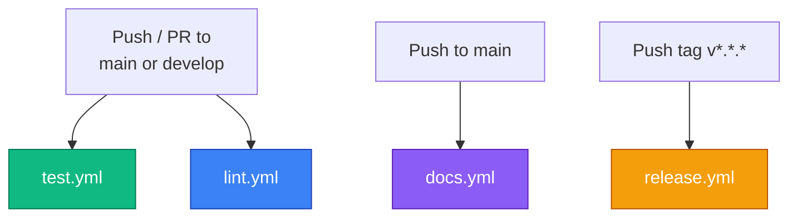

# CI/CD Pipelines

`kreview` uses four GitHub Actions workflows to automate testing, linting, documentation, and releases.

---

## Pipeline Overview

---

## Workflows

=== "test.yml"

    **Trigger:** Push or PR to `main` / `develop`

    | Step | What it does |
    |------|-------------|
    | Setup Python 3.12 | Caches pip dependencies |
    | Install dependencies | `pip install -e .[test]` |
    | Run pytest | `pytest --cov=kreview --cov-report=xml` |
    | Test package build | `python -m build` (dry-run, no publish) |
    | Test Docker build | Builds image with `push: false` |

    !!! info "Why test the build?"
        By validating both the Python wheel and Docker image on every PR, we catch packaging issues *before* they reach the release pipeline.

=== "lint.yml"

    **Trigger:** Push or PR to `main` / `develop`

    | Step | Tool |
    |------|------|
    | Formatting | `black --check .` |
    | Linting | `ruff check .` |
    | Type checking | `mypy kreview` |

=== "docs.yml"

    **Trigger:** Push to `main` only

    Builds the MkDocs Material site and deploys it to GitHub Pages using `mike` for versioned documentation. The `dev` alias always points to the latest `main` build.

=== "release.yml"

    **Trigger:** Push of a `v*.*.*` tag

    | Step | What it does |
    |------|-------------|
    | Build package | `python -m build` |
    | GitHub Release | Uploads `.whl` + auto-generated release notes |
    | **Publish to PyPI** | Uses OIDC Trusted Publishing (no API tokens) |
    | **Build Docker image** | Multi-stage build with Quarto |
    | **Push to GHCR** | Tags: `kreview:v*.*.*` and `kreview:latest` |
    | Deploy docs | `mike deploy --push --update-aliases $VERSION stable` |

    !!! warning "OIDC Requirement"
        PyPI Trusted Publishing requires the repository to be registered as a [Trusted Publisher](https://docs.pypi.org/trusted-publishers/) on pypi.org. This is a one-time setup.

---

## Required Permissions

| Workflow | Permission | Purpose |
|----------|-----------|---------|
| `release.yml` | `id-token: write` | PyPI OIDC authentication |
| `release.yml` | `packages: write` | Push Docker images to GHCR |
| `release.yml` | `contents: write` | Create GitHub Releases |
| `docs.yml` | `contents: write` | Push to `gh-pages` branch |
