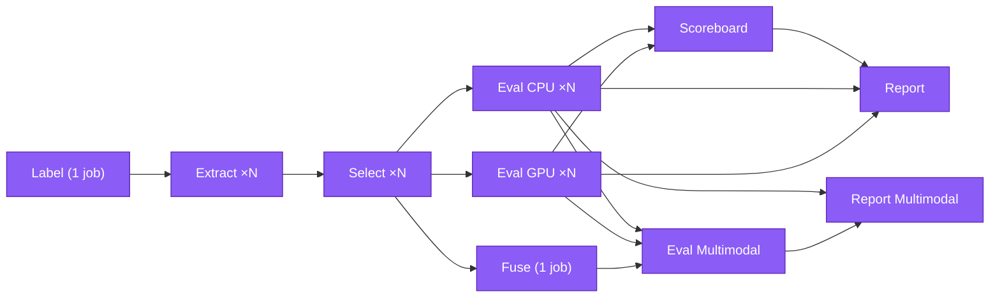

# Nextflow Integration

While `kreview` provides a robust, fully-featured CLI orchestrator, executing large-scale fragmentomics evaluation directly on local Posix systems (e.g. your laptop) can become a bottleneck when navigating tens of thousands of network parquet files.

For enterprise environments, `kreview` natively ships a standardized **nf-core DSL2 Nextflow pipeline wrapper**. This ensures `kreview` can securely attach to the execution tail of High-Performance Computing (HPC) workflows (like the MSK `krewlyzer` fragmentomics caller).

---

## Architecture Overview

All Nextflow pipeline logic resides within the `nextflow/` directory:

- `nextflow/main.nf` — Entrypoint (routes `--workflow eval` or `--workflow label`)
- `nextflow/nextflow.config` — Execution profiles, resource definitions, defaults
- `nextflow/workflows/kreview_eval.nf` — Pipeline DAG (monolithic or multistage)
- `nextflow/workflows/kreview_label.nf` — Standalone label-only workflow
- `nextflow/modules/local/kreview/` — Individual process modules:
    - `run.nf` — Monolithic mode (backward compatible)
    - `label.nf` — ctDNA labeling (runs once, shared across extractors)
    - `extract.nf` — Per-evaluator feature extraction (accepts `--labels`)
    - `select_single.nf` — Per-evaluator feature scoring + mRMR/hybrid-union selection
    - `eval_cpu_single.nf` — Per-evaluator CPU model evaluation (LR, RF, XGB)
    - `eval_gpu_single.nf` — Per-evaluator GPU model evaluation (TabPFN, TabICL)
    - `fuse.nf` — Super-matrix construction (all evaluators merged)
    - `scoreboard.nf` — Cross-evaluator scoreboard aggregation (v0.0.15)
    - `eval_multimodal.nf` — Cross-evaluator stacking + ablation
    - `report.nf` — HTML dashboard generation (6 inputs: matrices, JSONs, stats, QC, joblib, scoreboard)
    - `report_multimodal.nf` — Multimodal stacking dashboard

The pipeline supports two modes controlled by `params.pipeline_mode`:

- **`monolithic`** (default) — Single-process `KREVIEW_RUN` for backward compatibility.
- **`multistage`** — Decomposed DAG with per-evaluator parallelism:



!!! note "Report runs in parallel with Multimodal"
    After CPU/GPU eval complete, Scoreboard, Report, and Multimodal run **concurrently**. Report needs matrices + model results + scoreboard; Multimodal needs super_matrix + OOF probs.

For a detailed architecture overview with notebook-to-module mappings, see the [Pipeline Architecture](../developer/pipeline-architecture.md) developer guide.

The workflow transparently wraps the `kreview` Typer CLI, binding the computation natively to the `ghcr.io/msk-access/kreview:latest` container.

---

## Output Structure

In multistage mode, all process outputs are published to `params.outdir` via `publishDir` with `mode: copy`:

```
outdir/
├── labels/
│   └── labels.parquet                          # 5-tier ctDNA labels
├── matrices/
│   ├── raw/                                    # Per-evaluator raw feature matrices
│   │   ├── AtacOnTarget_matrix.parquet
│   │   ├── FSCOnTarget_matrix.parquet
│   │   └── ...
│   ├── selected/                               # After mRMR/hybrid selection
│   │   ├── AtacOnTarget_matrix.parquet
│   │   ├── AtacOnTarget_eval_stats.parquet
│   │   ├── AtacOnTarget_selection_qc.json
│   │   └── ...
│   └── fused/
│       └── super_matrix.parquet                # All evaluators merged
├── models/
│   ├── cpu/                                    # Per-evaluator CPU model results
│   │   ├── AtacOnTarget_model_results.json
│   │   ├── AtacOnTarget_lr_model.joblib
│   │   └── ...
│   ├── gpu/                                    # Per-evaluator GPU model results
│   │   ├── AtacOnTarget_gpu_model_results.json # Note: _gpu_ prefix avoids collision
│   │   └── ...
│   └── multimodal/
│       └── multimodal_results.json             # Cross-evaluator stacking
├── scoreboard_combined__all.parquet            # Cross-evaluator ranking (v0.0.15)
├── scoreboard_combined__all.csv
└── reports/
    ├── AtacOnTarget_dashboard.html
    └── ...
```

!!! tip "Inspecting Parquet Files on the CLI"
    Use [`parq-cli`](https://github.com/Tendo33/parq-cli) to inspect parquet files directly from the terminal without Python:
    ```bash
    parq schema labels/labels.parquet    # View column names and types
    parq meta   labels/labels.parquet    # View row count, compression, metadata
    ```

## Pipeline Execution

To trigger the `kreview` evaluation over a massive cohort using your standard Nextflow runner, use the `main.nf` script:

```bash
nextflow run /path/to/kreview/nextflow/main.nf \
  --cancer_samplesheet /data/cancer.csv \
  --healthy_xs1_samplesheet /data/healthy1.csv \
  --healthy_xs2_samplesheet /data/healthy2.csv \
  --cbioportal_dir /data/msk_solid_heme/ \
  --krewlyzer_dir /data/krewlyzer_parquets/ \
  --pipeline_mode multistage \
  --run_gpu_eval true \
  --gpu_models "tabpfn,tabicl" \
  --run_multimodal_eval true \
  --multimodal_selection boruta_shap \
  --multimodal_gpu_models "tabpfn,tabicl" \
  --ch_hotspot_maf /path/to/ch_hotspots.maf \
  --seed 42 \
  --deterministic true \
  -profile iris
```

!!! tip "Targeted Nextflow Execution"
    Just like the vanilla CLI, you can limit the Nextflow computation to specific features! You are allowed to pass the `--features` or `--tier` parameters dynamically through Nextflow:
    ```bash
    nextflow run nextflow/main.nf \
      ...
      --features "AtacOnTarget,FSCOnTarget"
    ```

---

## Profiling & Scaling (SLURM)

Because `kreview` accesses thousands of files aggressively using DuckDB, network filesystem socket limits (`Ulimit N`) behave entirely differently between a desktop Mac and a remote HPC SLURM cluster.

### 1. Local (Docker)
`nextflow run ... -profile docker` 

When operating locally, `nextflow.config` strictly maps `docker.runOptions = '-v /:/'` to guarantee absolute URI paths don't break the container's volume map. It safely hardcaps `--chunk-size` at `50` to defend local Posix max-file limits.

### 2. High-Performance Computing (SLURM)

Two SLURM profiles are available:

| Profile | Partition | Use Case |
|---------|-----------|----------|
| `slurm` | Generic | Default SLURM submission |
| `iris` | `cmobic_short` (3h) | MSK IRIS cluster with Singularity, auto-tuned CV and SHAP |

`nextflow run ... -profile iris`

The `iris` profile invokes `Singularity` (via `autoMounts = true`), targets the `cmobic_short` partition, and overrides the fallback logic. The configuration aggressively sets `--chunk-size 500` to maximize network ingestion speeds on hardware that naturally supports `102400` open network sockets. It also auto-tunes `cv_folds=10` and `shap_samples=5000` for production quality.

!!! warning "IRIS Compute Nodes Lack Internet"
    On IRIS, compute nodes cannot pull containers from GHCR. Use a **local clone** of the kreview repo instead of the `-r` GitHub remote:
    ```bash
    nextflow run /usersoftware/shahr2/github/kreview/nextflow/main.nf ...
    ```
    Singularity images are cached to `~/.singularity_cache/` on the login node.

---

## Averting Path-Staging Collapse

If Nextflow were allowed to behave natively, it would attempt to symlink all `14,000` Krewlyzer `.parquet` target output files independently into the isolated `.work/` module directory. This mathematically guarantees a localized freeze or file-limit crash on practically all operating systems.

To fundamentally solve this problem: 

> The `kreview` Nextflow module (`run.nf`) completely bypasses standard `path` file orchestration for the target Krewlyzer output. It captures `--krewlyzer_dir` exactly as an absolute Native `val` String, sending it securely inside the Python container.

You can safely drop either an absolute directory path or the explicit path to a `manifest.txt` file directly into the `--krewlyzer_dir` mechanism!
